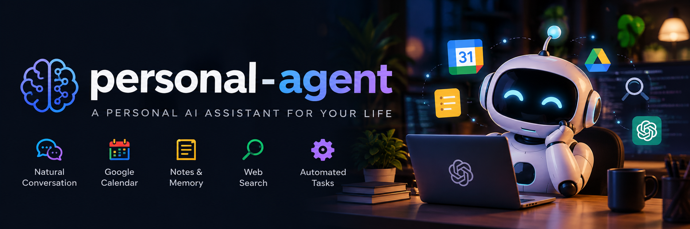

# Personal AI Agent

<p align="center">
  
</p>
A terminal-based personal AI agent with persistent memory, notes, inbox
notifications, scheduled tasks, web search, Google Calendar integration,
local semantic retrieval, command autocomplete, and API usage tracking.

## Project Structure

The application has two main components:

-   `agent` --- interactive terminal client
-   `agent-server` --- FastAPI backend

The terminal client communicates with the local backend over HTTP.
Personal data, credentials, databases, and generated embedding indexes
are intentionally kept outside version control.

## Contents

- [Features](#features)
- [Requirements](#requirements)
- [Storage Layout](#storage-layout)
- [Installation](#installation)
  - [macOS](#macos)
  - [Linux / Raspberry Pi OS](#linux--raspberry-pi-os)
  - [Windows](#windows)
- [Configuration](#configuration)
  - [Google Calendar](#google-calendar)
- [Commands](#commands)
- [Private and Generated Files](#private-and-generated-files)
- [Moving to a New Computer](#moving-to-a-new-computer)
- [Platform Notes](#platform-notes)
- [Uninstall](#uninstall)
- [Disclaimer](#disclaimer)
- [License](#license)

------------------------------------------------------------------------

## Features

-   Conversational terminal interface
-   Persistent long-term memory
-   Notes knowledge base with semantic retrieval
-   Local E5 embeddings via Sentence Transformers
-   Inbox and notification management
-   Scheduled tasks
-   Google Calendar integration
-   Web search
-   API usage and estimated cost tracking
-   Bounded tool and web-search execution to limit runaway API usage
-   Tool authorization for destructive operations and long-term memory writes
-   Sandboxed workspace filesystem access restricted to `~/PersonalAgent`
-   Slash-command autocomplete
-   macOS, Linux, Raspberry Pi OS, and Windows support

## Requirements

-   Python 3.12 (tested and recommended)
-   An OpenAI API key
-   Internet access for OpenAI API and web-search functionality
-   Google Calendar credentials if Calendar integration is used
-   Git, if cloning the repository

Python dependencies are listed in `requirements.txt`.

> **Python version:** Python 3.12 is the tested and recommended version for this project. You can keep newer Python versions installed on your computer; create this project's `.venv` with Python 3.12. Python 3.13 or 3.14 may encounter compatibility problems with pinned machine-learning dependencies such as NumPy, PyTorch, or Sentence Transformers.

------------------------------------------------------------------------

# Storage Layout

Personal Agent separates application code from private state and user files. This makes upgrades safer and gives the workspace a clear filesystem security boundary.

### Linux / Raspberry Pi OS

```text
/home/YOUR_USERNAME/
│
├── PersonalAgent/                         ← USER WORKSPACE
│   └── ...                                ← files and folders managed by you/agent
│
├── .local/
│   ├── bin/
│   │   └── agent                          ← command-line launcher
│   │
│   ├── lib/
│   │   └── personal-agent/                ← APPLICATION
│   │       ├── agent
│   │       ├── agent-server
│   │       ├── requirements.txt
│   │       ├── .env.example
│   │       ├── README.md
│   │       ├── LICENSE
│   │       ├── assets/
│   │       └── .venv/
│   │
│   └── share/
│       └── personal-agent/                ← PERSISTENT DATA
│           ├── agent.db
│           ├── notes.db
│           ├── memory.json
│           └── rules.json
│
├── .config/
│   ├── personal-agent/                    ← PRIVATE CONFIGURATION
│   │   ├── .env
│   │   ├── google_token.json
│   │   ├── credentials.json
│   │   └── client_secret*.json
│   │
│   └── systemd/
│       └── user/
│           └── personal-agent.service
│
└── .cache/
    └── personal-agent/                    ← REBUILDABLE CACHE
        ├── memory_embeddings.npz
        └── note_embeddings.npz
```

### macOS

```text
/Users/YOUR_USERNAME/
│
├── PersonalAgent/                         ← USER WORKSPACE
│   └── ...                                ← files and folders managed by you/agent
│
├── .local/
│   └── bin/
│       └── agent                          ← command-line launcher
│
└── Library/
    │
    ├── Application Support/
    │   └── PersonalAgent/
    │       │
    │       ├── app/                       ← APPLICATION
    │       │   ├── agent
    │       │   ├── agent-server
    │       │   ├── requirements.txt
    │       │   ├── .env.example
    │       │   ├── README.md
    │       │   ├── LICENSE
    │       │   ├── assets/
    │       │   └── .venv/
    │       │
    │       ├── config/                    ← PRIVATE CONFIGURATION
    │       │   ├── .env
    │       │   ├── google_token.json
    │       │   ├── credentials.json
    │       │   └── client_secret*.json
    │       │
    │       └── data/                      ← PERSISTENT DATA
    │           ├── agent.db
    │           ├── notes.db
    │           ├── memory.json
    │           └── rules.json
    │
    ├── Caches/
    │   └── PersonalAgent/                 ← REBUILDABLE CACHE
    │       ├── memory_embeddings.npz
    │       └── note_embeddings.npz
    │
    ├── LaunchAgents/
    │   └── com.personalagent.server.plist
    │
    └── Logs/
        ├── PersonalAgent.log
        └── PersonalAgent-error.log
```

### Windows

The server uses the corresponding per-user AppData locations for private configuration/data/cache and `~/PersonalAgent` as the workspace.

The workspace is intentionally user-visible. Agent filesystem tools are restricted to `~/PersonalAgent`; requested paths are resolved before the boundary check so `..` traversal and symlinks cannot be used to escape the workspace. Do not place API keys, SSH keys, or other application secrets in the workspace.

Private state is no longer stored beside `agent` and `agent-server`. Reinstalling application code therefore does not require copying databases or memory files out of the application directory.

------------------------------------------------------------------------

# Installation

For macOS and Linux/Raspberry Pi OS, the recommended installation method is the automatic installer. It detects the platform, installs the application and Python environment, creates the appropriate storage directories, configures the launcher, and can install the background service.

## macOS

### Quick Install (Recommended)

Run:

```bash
curl -fsSL https://raw.githubusercontent.com/ahmetkadiraksoy/personal-agent/main/installer.sh | bash
```

The installer places the application and private state in the macOS locations shown in [Storage Layout](#storage-layout), creates the `agent` launcher, prompts for the OpenAI API key when necessary, and can install/start the LaunchAgent. Existing configuration, databases, memory, and workspace files are kept outside the application directory so reinstalling the application does not overwrite them.

After installation, start the terminal client with:

```bash
agent
```

### Service management

Check the background service:

```bash
launchctl print gui/$(id -u)/com.personalagent.server
```

Restart it:

```bash
launchctl kickstart -k gui/$(id -u)/com.personalagent.server
```

View logs:

```bash
tail -f ~/Library/Logs/PersonalAgent.log
```

View errors:

```bash
tail -f ~/Library/Logs/PersonalAgent-error.log
```

------------------------------------------------------------------------

## Linux / Raspberry Pi OS

### Quick Install (Recommended)

Run:

```bash
curl -fsSL https://raw.githubusercontent.com/ahmetkadiraksoy/personal-agent/main/installer.sh | bash
```

The installer places the application and private state in the Linux locations shown in [Storage Layout](#storage-layout), creates the `agent` launcher, configures the Python environment and dependencies, prompts for the OpenAI API key when necessary, and can install/start the per-user `systemd` service. On supported ARM64 systems such as Raspberry Pi, it installs CPU-only PyTorch.

After installation, start the terminal client with:

```bash
agent
```

### Service management

The installer uses a **user-level** systemd service. Do not use `sudo` for normal service management.

Check status:

```bash
systemctl --user status personal-agent
```

Start:

```bash
systemctl --user start personal-agent
```

Stop:

```bash
systemctl --user stop personal-agent
```

Restart:

```bash
systemctl --user restart personal-agent
```

View recent logs:

```bash
journalctl --user -u personal-agent -n 100 --no-pager
```

Follow logs live:

```bash
journalctl --user -u personal-agent -f
```

To allow the user service to start at boot without an interactive login, enable lingering once (replace `YOUR_USERNAME` if necessary):

```bash
sudo loginctl enable-linger YOUR_USERNAME
```

Verify:

```bash
loginctl show-user YOUR_USERNAME -p Linger
```

------------------------------------------------------------------------

## Windows

PowerShell is recommended.

### 1. Install Python and Git

Install Python 3.12 and Git for Windows. You may keep newer Python versions installed alongside Python 3.12.

During Python installation, enable the option to add Python to `PATH`.

Verify in PowerShell:

``` powershell
py -3.12 --version
git --version
```

If `python` is unavailable but the Python launcher is installed, try:

``` powershell
py --version
```

### 2. Get the project

``` powershell
git clone https://github.com/ahmetkadiraksoy/personal-agent.git
cd personal-agent
```

Alternatively, download the repository ZIP from GitHub and extract it.

### 3. Create a virtual environment

Create the virtual environment explicitly with Python 3.12:

``` powershell
py -3.12 -m venv .venv
```

Activate it:

``` powershell
.\.venv\Scripts\Activate.ps1
```

Verify that the virtual environment is using Python 3.12:

```powershell
python --version
```

If PowerShell prevents activation because of its execution policy, the
environment can instead be used without activation by invoking its
Python executable directly, or the execution policy can be configured
according to the organization's security requirements.

### 4. Install dependencies

``` powershell
python -m pip install --upgrade pip
python -m pip install -r requirements.txt
```

### Download the local embedding model

The agent uses the local `intfloat/multilingual-e5-base` Sentence Transformers model for semantic memory and note retrieval. The model is approximately 500 MB and is downloaded only once; afterward it is loaded from the local Hugging Face cache.

Download and cache it during installation:

```bash
python -c "from sentence_transformers import SentenceTransformer; SentenceTransformer('intfloat/multilingual-e5-base')"
```

This keeps the first `agent-server` startup from unexpectedly downloading the model. The embedding model runs locally on your computer; do not add the downloaded model files to the GitHub repository.


### 5. Configure the environment

The agent uses a `.env` file to store configuration values that should **not** be included in the GitHub repository, particularly your OpenAI API key.

The repository includes `.env.example`, a safe configuration template with no secrets. Copy it to `.env` so the template remains available while `.env` stores your machine-specific private configuration.

On **macOS or Linux**:

```bash
cp .env.example .env
nano .env
```

On **Windows PowerShell**:

```powershell
New-Item -ItemType Directory -Force "$env:APPDATA\PersonalAgent" | Out-Null
Copy-Item .env.example "$env:APPDATA\PersonalAgent\.env"
notepad "$env:APPDATA\PersonalAgent\.env"
```

Then set your OpenAI API key in `.env`:

```dotenv
OPENAI_API_KEY=your_openai_api_key_here
```

Replace `your_openai_api_key_here` with your actual OpenAI API key. For example:

```dotenv
OPENAI_API_KEY=sk-example123
```

Do not put quotation marks around the key unless your value specifically requires them.

If you do not already have an OpenAI API key, create one through the OpenAI API platform. An API key is separate from a ChatGPT subscription; API usage is billed through the OpenAI API account.

After saving the file, the private `.env` remains outside the source-code directory.

The source-code directory does not need to contain `.env`.

The `.env` file must remain local. **Do not upload or commit it to GitHub.** The repository's `.gitignore` is configured to exclude it.

To verify that the variable is being loaded correctly without displaying the secret itself, activate the project's virtual environment and run:

```bash
python -c "from dotenv import load_dotenv; import os; load_dotenv(os.path.expanduser('~/.config/personal-agent/.env')); print('OpenAI API key configured:', bool(os.getenv('OPENAI_API_KEY')))"
```

A successful configuration should print:

```text
OpenAI API key configured: True
```

You can then start `agent-server` and the `agent` client as described below.
### 6. Run the application

The `agent` and `agent-server` files use Unix-style executable behavior,
so on Windows the most portable approach is to invoke them through
Python:

``` powershell
python .\agent-server
```

Then open another PowerShell window, activate the virtual environment,
and run:

``` powershell
python .\agent
```

If the scripts depend on Unix-specific behavior in a future version,
Windows Subsystem for Linux (WSL) is an alternative way to run the Linux
installation.

------------------------------------------------------------------------

## Optional: Run the server automatically with Windows Task Scheduler

This step is optional. On Windows, Task Scheduler can provide the equivalent behavior: start `agent-server` automatically when you sign in and keep the terminal client separate.

The example below assumes:

```text
Project: C:\Users\YOUR_USERNAME\Documents\personal-agent
Virtual environment: C:\Users\YOUR_USERNAME\Documents\personal-agent\.venv
```

Replace the paths with your actual installation location.

### Create the scheduled task

1. Open **Task Scheduler**.
2. Select **Create Task**.
3. On **General**:
   - Name it `Personal AI Agent Server`.
   - Select **Run only when user is logged on** unless you specifically need background execution before login.
4. On **Triggers**:
   - Create a trigger **At log on** for your user account.
5. On **Actions**, create **Start a program**.
6. For **Program/script**, enter:

```text
C:\Users\YOUR_USERNAME\Documents\personal-agent\.venv\Scripts\python.exe
```

7. For **Add arguments**, enter:

```text
C:\Users\YOUR_USERNAME\Documents\personal-agent\agent-server
```

8. For **Start in**, enter:

```text
C:\Users\YOUR_USERNAME\Documents\personal-agent
```

9. Save the task.

### Service management

Start the task manually from PowerShell:

```powershell
Start-ScheduledTask -TaskName "Personal AI Agent Server"
```

Check its state:

```powershell
Get-ScheduledTask -TaskName "Personal AI Agent Server"
```

Stop it:

```powershell
Stop-ScheduledTask -TaskName "Personal AI Agent Server"
```

Disable automatic execution:

```powershell
Disable-ScheduledTask -TaskName "Personal AI Agent Server"
```

Enable it again:

```powershell
Enable-ScheduledTask -TaskName "Personal AI Agent Server"
```

After the scheduled task is running, start only the client when needed:

```powershell
cd C:\Users\YOUR_USERNAME\Documents\personal-agent
.\.venv\Scripts\Activate.ps1
python .\agent
```

### After updating the code

If only `agent` changes, no backend restart is required.

If `agent-server` changes, restart the scheduled task:

```powershell
Stop-ScheduledTask -TaskName "Personal AI Agent Server"
Start-ScheduledTask -TaskName "Personal AI Agent Server"
```

If you change the task configuration itself, update it in Task Scheduler.

---

# Configuration

Private configuration is stored outside the application directory.

- Linux / Raspberry Pi OS: `~/.config/personal-agent/.env`
- macOS: `~/Library/Application Support/PersonalAgent/config/.env`
- Windows: `%APPDATA%\\PersonalAgent\\.env`

At minimum, set the OpenAI API credentials expected by `agent-server`. The repository's `.env.example` can be copied to the appropriate configuration directory. The installer does this automatically and can securely prompt for the API key without echoing it to the terminal.

Do not put API keys directly into `agent` or `agent-server`, and do not put secrets in `~/PersonalAgent`.

## Resource and Safety Limits

The server applies conservative execution limits to interactive requests and background scheduled tasks. These limits reduce redundant tool calls, bound web-search activity, prevent failed scheduled jobs from retrying indefinitely, and keep oversized tool results from consuming unnecessary model context.

The defaults can be overridden in the private `.env` configuration when needed:

```dotenv
INTERACTIVE_MAX_TOOL_ROUNDS=8
INTERACTIVE_MAX_WEB_SEARCHES=5
SCHEDULED_TASK_MAX_TOOL_ROUNDS=4
SCHEDULED_TASK_MAX_WEB_SEARCHES=3
SCHEDULED_TASK_MAX_ATTEMPTS=1
SCHEDULED_TASK_PREVIOUS_RESULT_MAX_CHARS=3000
SCHEDULED_TASK_TIMEOUT_SECONDS=120
SCHEDULED_TASK_FAILURE_DISABLE_THRESHOLD=3
TOOL_OUTPUT_MAX_CHARS=12000
```

When a tool or web-search budget is exhausted, the agent is instructed to finish from the information already collected rather than treating the budget limit itself as an error. Scheduled tasks that fail repeatedly across separate scheduled occurrences are automatically disabled after the configured failure threshold.

These resource controls complement the server's authorization layer. Destructive operations and long-term memory writes require appropriate user intent, and filesystem tools are restricted to the `~/PersonalAgent` workspace boundary.

## Google Calendar

Google Calendar support is optional.

If Calendar integration is enabled, Google OAuth credentials and
generated authentication tokens should remain local. Do not commit
Google credential or token files to the repository.

A new machine may require Google authorization again because
authentication tokens are deliberately not stored in GitHub.

------------------------------------------------------------------------

# Commands

## Knowledge

``` text
/memory                    List memories
/memory <query|number>     Search or open a memory
/notes                     List notes
/notes <query|number>      Search or open a note
/history                   Show chat history
```

## Inbox

``` text
/inbox                     List inbox
/inbox <number>            Open an entry
/inbox read <number>       Mark an entry as read
/inbox unread <number>     Mark an entry as unread
/inbox remove <number>     Remove an entry
```

## Tasks

``` text
/tasks                     List tasks
/tasks run <number>        Run a task
/tasks enable <number>     Enable a task
/tasks disable <number>    Disable a task
/tasks remove <number>     Remove a task
```

## Session

``` text
/stateless                 Toggle stateless mode
/clear                     Clear conversation history
```

## Information

``` text
/status                    Show agent status
/usage                     Show usage and estimated API costs
/rules                     Show behavior rules
/help                      Show command help
```

## Exit

``` text
/exit                      Exit the client
/quit                      Exit the client
```

Tab completion is available for commands and supported items.

------------------------------------------------------------------------

# Private and Generated Files

The repository should contain source code and safe configuration templates, not personal data.

Private configuration includes `.env`, Google OAuth tokens, credentials, and client-secret files. Persistent data includes `memory.json`, `notes.db`, `agent.db`, and `rules.json`. Rebuildable embedding indexes are stored in the platform cache directory.

The user workspace is `~/PersonalAgent/`. It is intentionally separate from both application code and private configuration. Agent filesystem tools may access only this workspace.

Never commit an OpenAI API key, Google OAuth token, client secret, personal memory database, or other credential.

------------------------------------------------------------------------

# Moving to a New Computer

To recreate the agent on another computer, install the application normally and then copy only the state you intentionally want to migrate: the configuration directory, persistent data directory, and `~/PersonalAgent/` workspace. Cached embedding indexes may be copied but are rebuildable.

Do **not** copy `.venv` between operating systems or computers. Create a fresh virtual environment on each machine.

Google Calendar may require authorization again if its token is not migrated or is no longer valid.

------------------------------------------------------------------------

# Platform Notes

The application-level Python code is largely the same across macOS,
Linux, and Windows. Differences mainly involve:

-   Installing Python and system packages
-   Virtual-environment activation commands
-   Executable script behavior
-   Background-service management
-   Platform-specific binary dependencies

Sentence Transformers and PyTorch may install different binary packages
depending on the operating system and CPU architecture. This is
expected.

For persistent background operation:

-   Linux / Raspberry Pi OS: `systemd`
-   macOS: `launchd`
-   Windows: Task Scheduler or a Windows service

These are optional; the agent can be run manually from a terminal on all
supported platforms.

------------------------------------------------------------------------


# Uninstall

The cross-platform installer can manage removal. When it detects an existing installation, choose **Remove application**. It then offers two modes:

1. **Remove app, keep settings/data/workspace** — removes application code, launcher, and background service while leaving private state and `~/PersonalAgent/` intact for a future reinstall.
2. **Completely remove everything** — after an explicit `REMOVE EVERYTHING` confirmation, removes application code, configuration, persistent data, cache, credentials, and the workspace.

For manual installations, stop/remove the platform background service first, then remove only the directories you intend to delete. Application code and personal state are separate by design; deleting the application directory alone does not delete memories, notes, configuration, or workspace files.

You generally do **not** need to uninstall Python, Git, or other system-wide development tools.

------------------------------------------------------------------------

## Disclaimer

This software is provided for personal and educational use without warranty. Users are responsible for securing their credentials, reviewing API usage and associated costs, protecting locally stored data, and complying with the terms, policies, and requirements of any third-party services they connect to the software.

# License

This project is licensed under the [MIT License](LICENSE).
